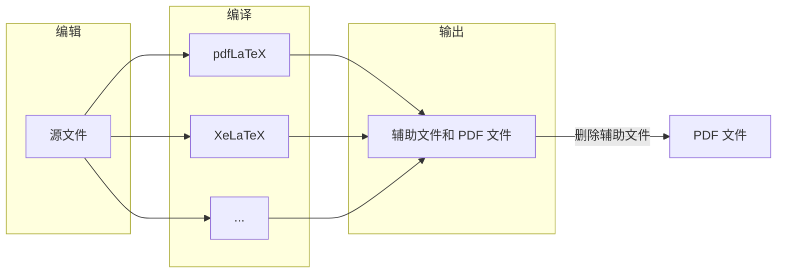

LaTeX 是一款排版软件, 常用于理工科专业文档的排版. 这篇文档旨在提供一个不完整但容易上手的、现代的入门指引. 我认为学习一项技术, 尤其是一种工具, 最有效的方式并不是去阅读一本完整的教程, 而是直接去动手实践, 在实践中逐步学习需要的部分. 作为一款排版软件, LaTeX 的试错成本尤其低廉 (可能只是编译失败一次需要的时间和电量吧), 所以更适合如此入门. <!--more-->

## 先做出一个东西再说

废话少说, 我们先做出点东西, 再来介绍使用 LaTeX 排版的基本逻辑.

第一步, 进入 [Overleaf](https://www.overleaf.com) 或对应的[中文版](https://cn.overleaf.com), 免费注册账号并登录. 本文后续的演示以英文版为例.

<figure><figcaption>注册并登录后的页面</figcaption></figure>

第二步, 点击左上的 New Project, 选择 Blank Project, 并在弹出的框内输入文档标题 A Starting Document, 加载后界面如下图所示 (加载可能较慢, 需要一点耐心). 

<figure><figcaption>新项目的初始页面</figcaption></figure>

此时我们可以看到界面分三个部分, 最左边是文件树 (file-tree), 在涉及多文件编辑时可以方便地切换文件, 这里我们只有一个文件 ``main.tex``, 因此可以点击中间的小箭头将其收起. **源文件** (source) ``main.tex`` 的内容在中间一栏展示, 我们的所有编辑和改动都是在源文件上进行的, 源文件经过**编译** (compile) 将得到一个 PDF 文件, 在界面右侧.

我们对源文件中的代码作以说明.
- ``\documentclass{article}``: 指定文档类别为 "article", 这是最常用的文档类别, 其他文档类别包括 book 等.
- LaTeX 中各种命令均以反斜线 "\\" 开头, 常见形式为 ``\COMMAND{PARAM1}{PARAM2}...``, 即反斜线后是命令, 命令后面是花括号内的参数. 参数的数量可以是 0, 1, 2, ... 在上述设置文档类型的命令中, ``documentclass`` 为命令, ``article`` 是唯一的参数.
- ``\usepackage[utf8]{inputenc}``: 设置编码为 UTF-8. 目前不重要.
- ``\title{A Starting Document}``: 设置文档标题. 标题格式已经自动定制好, 如何修改格式我们后面再作介绍. 设置作者和日期的命令类似, 故不赘述.
- ``\begin{document}...\end{document}``: 文档环境. 一个 LaTeX 文档的正文均在 "document" 环境中.
- 环境 (environment) 是 LaTeX 源文件最重要的结构. 环境 "ENVIRONMENT" 以 ``\begin{ENVIRONMENT}`` 开始, 以 ``\end{ENVIRONMENT}`` 结束. 最大的环境为 "document", 我们还将见到 "equation" 等环境.
- ``\maketitle``: 显示标题、作者、日期等在文件头部 (即 document 环境开始前) 定义的信息. 这是一个没有参数的命令.
- ``\section{}``、``\subsection{}``、 ``\subsubsection{}``等, 是小节、次小节、次次小节等的命令, 唯一的参数是节标题.

第三步, 对源文件加以修改, 例如

```latex
\documentclass{article}
\usepackage[utf8]{inputenc}
\usepackage{amsmath}

\title{A Starting Document}
\author{A Smart Guy}
\date{\today}

\begin{document}

\maketitle

\section{A minor example}

\subsection{Paragraphs}

The default paragraph setting of \LaTeX\ is that the first paragraph in a section is not indented, while the following paragraphs are indented. This is also the common convention in English documents. 

To start a new paragraph, one just inserts a blank line. Here I add one more sentence to make this paragraph look more like a paragraph. 

\subsection{Equations}

There are two kinds of equations in an article. One is inline equation which is integrated into the texts, and the other is display equation which forms a single line. Inline equation is realized by dollar symbols. For example, the Newton's Second Law is $F=ma$. The display equations are realized by `equation environment'\footnote{Note that the quotation marks is `quoted' rather than 'quoted'. The compiling engine is not smart enough to distinguish left and right marks. To input double marks you just need to type single mark twice like ``quoted''.}. For example, the Euler-Lagrangian equation in mechanics is 
\begin{equation}
    \frac{\mathrm{d}}{\mathrm{d}t}\frac{\partial L}{\partial \dot{q}_i}-\frac{\partial L}{\partial q_i}=0.
    \label{Euler-Lagrangian}
\end{equation}
Note that equation is automatically numbered. If you want an equation without auto numbering, you can use `equation* environment'. For example,
\begin{equation*}
    \int_0^{\pi}\cos^2 x\,\mathrm{d}x=\frac{\pi}{2}.
\end{equation*}
Numbered equations can be referred to conveniently. You do not need to worry that the number of the equation may be altered if you insert something before it. Instead, what you need to do is to set a `label' for the equation and use this label to refer to the equation. For example, Euler-Lagrangian equation (\ref{Euler-Lagrangian}) is very important in analytic mechanics.

\end{document}
```

点击 PDF 文件左上的 Recompile 或利用快捷键 ``Cmd``+``S`` (对于 Windows 系统, ``Cmd`` 换成 ``Ctrl``) 保存更改并编译, 得到新的 PDF 文件.

<figure><figcaption>将上述源文件编译后得到的结果</figcaption></figure>

这里我们对上面的改动进行说明.
- ``\usepackage{amsmath}``: 宏包 (package) 是其开发者写好的文件, 用来实现各种额外功能, 使用 ``\usepackage{}`` 命令调用. ``amsmath`` 宏包被用以支持各种数学排版, AMS 是美国数学会的简称. 如果文章中需要输入公式, 则需该命令.
- ``\LaTeX``: 没有参数的命令, 显示 LaTeX 的官方符号.
- 行内公式在两个美元符号中间输入.
- 行间公式在 equation 环境中输入, 其中的字符默认为斜体. 
- ``\frac{NUMERATOR}{DENOMINATOR}`` 是分式的命令, 第一个参数是分子, 第二个参数是分母.
- ``\mathrm{}`` 是在公式环境中显示正体字符的命令, 参数为需要用正体显示的文字.
- ``\partial`` 是偏微分符号的命令, 没有参数.
- ``^`` 后为上标, ``_`` 后为下标, 如果符号不止一个则需用花括号将其括成一个整体. ``\pi`` 只有一个符号, 但较为复杂, 为了源文件的可读性我们也使用了花括号.

上述示例文档还展示了公式自动编号和引用、脚注等功能, 并提示了 LaTeX 中引号的输入方法, 读者不难自己理解.

## 中文支持

到目前为止我们已经做出了一个英文的文档, 下面我们来制作一个中文文档. 在一些文物级别的 LaTeX 介绍中, 你会看到一个叫作 CTEX 套装的东西, 如果你点进它的[官网](http://www.ctex.org/CTeXReleaseNotes), 你会发现它最后一次更新在 2012 年. 这意味着什么? 苏东坡的观点是

> 十年生死两茫茫, 不思量, 自难忘.

林夕和陈奕迅的观点是

> 十年之前<br>
我不认识你 你不属于我<br>
我们还是一样<br>
陪在一个陌生人左右<br>
走过渐渐熟悉的街头<br>
十年之后<br>
我们是朋友 还可以问候<br>
只是那种温柔<br>
再也找不到拥抱的理由<br>
情人最后难免沦为朋友

而声音玩具乐队认为

> 青春的人儿啊<br>
想想一个人的十年会怎样<br>
足够让许多选择发生<br>
许多人事来来往往<br>
此刻你深爱着的啊<br>
是那多少个十年后的少年<br>
他是否依旧那么年轻<br>
是否依旧那么热情

所以我们的建议是就让这个套装优雅地停留在上一代学者的记忆中吧.

言归正传, 令 LaTeX 支持中文有许多种方案, 我认为最方便的一种 (也是我最常用的一种是调用 ctex 宏包). 例如将源文件更改为

```latex
\documentclass{article}
\usepackage[utf8]{inputenc}
\usepackage{amsmath} 
\usepackage{ctex}

\title{中文文档}
\author{我就是作者}
\date{\today}

\begin{document}

\maketitle

\section{示例}

这是一篇中文文档.

\end{document}
```

编译...... 出错了.

<figure><figcaption>中文文档, 编译出错</figcaption></figure>

出错的原因是, Overleaf 默认使用 pdfLaTeX 程序编译, 这种编译器 (compiler) 不支持中文. 点击页面左上角的 Menu, 将 Compiler 勾选为 XeLaTeX, 如下图. 

<figure><figcaption>选择不同的编译器</figcaption></figure>

重新编译后即得到正确的 PDF 文件. 

<figure><figcaption>编译成功的中文文档</figcaption></figure>

## 本地编辑

上述操作都是在线进行的. 在线进行的好处是随时在线保存, 且 Overleaf 具有强大的合作功能; 坏处是由于某些原因, Overleaf 比较不稳定, 经常断连, 且 Overleaf 自动补全的功能有限; 不知道是好处还是坏处的特点是, 没有网络可以成为不干活的借口. 无论如何, 本地编辑的方法是有必要介绍一下的.

### 使用 LaTeX 排版的逻辑

在介绍本地编辑的方法之前, 我们先从上面在线编辑的例子中总结一下使用 LaTeX 排版的逻辑. 众所周知的、不时卡死的、人民群众喜闻乐见的 Word 采用的是 “所见即所得” 的模式, 即编辑页面和最终展示的文档是同一的. LaTeX 则不同, 如下图, 它的基本逻辑是 “编辑-编译-输出”. 所有编辑操作是在源文件中进行的, 源文件的后缀名为 ``.tex``, 编辑好之后将源文件交给编译器, 如果是纯英文的文件 pdfLaTeX 就足够, 中文文档则需使用 XeLaTeX 编译, 编译器将输出 PDF 文件和其他辅助文件, Overleaf 自动删除或隐藏了辅助文件, 稍后本地编辑时我们可以看清楚辅助文件都有哪些, 当然在入门阶段, 看清楚辅助文件有哪些的目的仅仅是把它们删掉而已.



因此, 对应编辑、编译、输出三个模块, 在本地使用 LaTeX 排版就需要下载编辑器、编译程序和 PDF 阅读器. 本文介绍 VSCode + TeXLive 的方案.

### 下载软件

